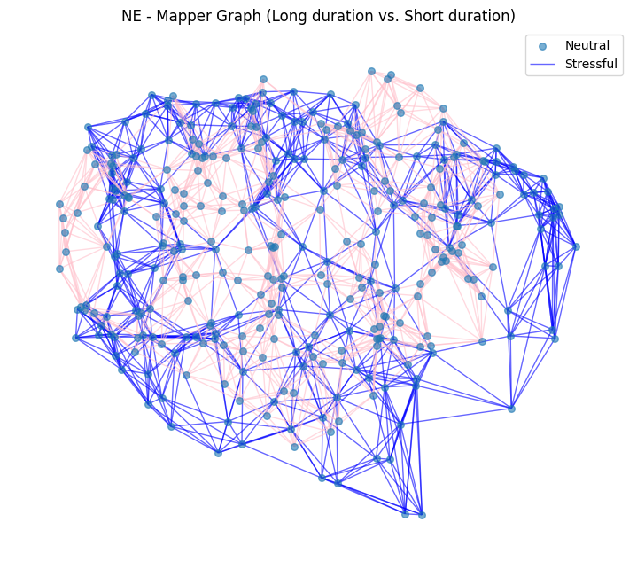
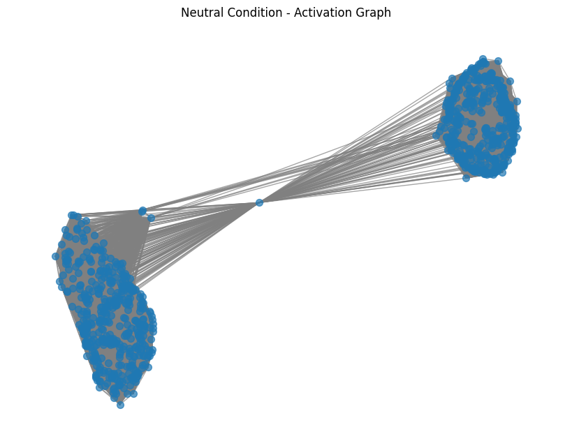

# Blue Dot Project: A Neural Gadget Controller
We study into Locus Coeruleus (Blue Dot) Norepinephrine System and its potential links to rumination using a computational methods. We try to leverage thepower of neural network to build an **neural gadget controller**, inspired by the *Neural Turing Machine*, and fit to an neurosciecne behavioral dataset related to pupil dilation & memory. There are 3 key points to this project:

1. we want to use the the idea of building an **mechanistic model**:
    - Very interpretable model as we control each "mechanistic" controller in seeing what might happen if we change something.

2. we want to create a **gadget** for network to use:
    - Instead of modifying the models directly, maybe we can take an approach that the Neural Turing Machine (NTM) did and try to create a gadget (in NTM it represents memory for read and write) and for us the gadget can be think of as teh LC-NE system.
    - It need to be differentiable so everything can be back propoagted and we can see if the network can learn to use this controller (LC-NE system) to achieve the effect we see in the samples.

3. We want to represent abstract concepts in **internal state** of the model:
    - Conduct persistent homology analysis with statistical test to see formations of connected components and cyclic cycles as an analogy of thoughts and rumination.
    - Examine uncertainty changes in decision.

We can use this fitteed model to prompt them under certain `experimental` conditions and see hwo they would react to as compares to rea behavior data from animals or human (i.e. the two lick test for rodent).

- [Pitch presentation model proposition section (hosted in UCSD Podemos)](https://www.youtube.com/watch?v=KdRzyWItoa0)

## Preliminary Results & Analysis:
We provide an [sample notebook](https://github.com/KevinBian107/Blue-Dot-Project/blob/main/simulate.ipynb) for demostration purposes. Now  we have a sand-box that has been setup  to implement all kinds of cool neuroscience ideas that we can do. We have also created a [neural gadget controller architecture](https://github.com/KevinBian107/Blue-Dot-Project/blob/main/results/model_graph.md) diagram for showcase our model pipeline.

| Activation Space Persistent Homology Analysis | PCA Activation Network Graph (Seperated) | Cosine Similarity Graph in Activation Space |
|--------------|--------------|--------------|
| | | | 

### Representation of Rumination:
We take a very unique approach in representing what ruminations are in our network, through the scope of topological structure analysis and doing different forms of hypotehsis testing upon them. Particularly, we can look at something called persistent homology:

- 𝐻₀ → Represents connected components (clusters in LC activation).
- 𝐻₁ → Represents loops (1D holes in the data, cyclic structures in LC activation).
- Diagonal Line → Features close to the diagonal are short-lived (noise).
- Dashed Line (∞) → Features that never die represent persistent structures in the data.

1️⃣ **𝐻₀ → Connected Components (Stable Thought States)**
- Represents distinct activation states of LC.
- Few long-lived components → Suggests stable attractor states in LC activation, possibly corresponding to persistent thought patterns.
- Many short-lived components → Indicates a highly dynamic LC state, suggesting flexible thought processes rather than being stuck in loops.

> **Key**: connected components indicates thoughts.
>
> - If 𝐻₀ features persist (far from diagonal), this could indicate LC stabilization, linked to difficulty in shifting thoughts (rumination).
> - If 𝐻₀ features quickly disappear, LC activity may dynamically support cognitive flexibility, allowing for thought transitions.

2️⃣ **𝐻₁ → Cycles in LC Activity (Recursive Thoughts)**
- Represents loops in activation patterns, indicating recurrent or cyclic thought processes.
- Few short-lived loops → Suggests transient, non-repetitive activity.
- Many persistent loops → Could indicate self-reinforcing thought cycles, similar to recursive thinking in rumination.

> **Key**: connected components indicates close/open loops of thoughts.
> - Persistent loops (far from diagonal) may correspond to sustained LC activity patterns, reinforcing self-referential thought loops seen in rumination.
> - Short-lived loops (near diagonal) suggest transient fluctuations in LC activity, possibly linked to shifts in attention or task engagement.

## Data Source:
The [openneuro](https://openneuro.org/) is a very good source of data, we are specifically using this ["Locus coeruleus activity strengthens prioritized memories under arousal"](https://openneuro.org/datasets/ds002011/versions/1.0.0) dataset for now.